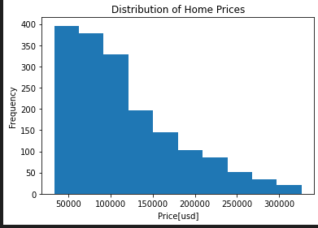
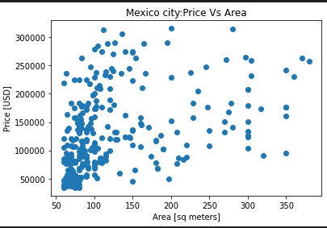

### HOUSING IN MEXICO

This project analyzes housing data from the Mexican real estate market with the aim of understanding patterns in home prices, sizes, and locations. The dataset was cleaned and prepared to ensure reliability before performing exploratory data analysis. Through visualizations such as maps, histograms, and boxplots, the project highlights how housing characteristics are distributed and how they vary across locations. The analysis provides insights into market trends and supports data-driven understanding of housing dynamics in Mexico.

### Problem Statement

The Mexican housing market contains large volumes of property data that are often inconsistent and difficult to analyze without proper cleaning and preparation. Poor data quality limits the ability to understand housing price distributions, size variability, and location-based patterns. There is a need to clean and explore housing data to identify meaningful trends that can support decision-making related to housing affordability, urban development, and market analysis.

### Project Objectives

- To clean and prepare housing data for accurate analysis.

- To explore the distribution of home sizes and prices in the Mexican housing market.

- To visualize the geographical distribution of housing listings.

- To identify key patterns that explain housing affordability and market concentration.

- To establish a foundation for future predictive and comparative housing analysis.

### DATASET INFORMATION

Our dataset contains information on residential properties in Mexico, including housing prices, location details, and property characteristics. It is used to analyze housing trends and price variations across different regions in the Mexican real estate market

### Results and Analysis
### Distribution of Home Prices using a Histogram

The histogram shows the distribution of home prices in U.S. dollars. The x-axis represents the price ranges, while the y-axis indicates the frequency of properties within each range. The visualization reveals that most homes are concentrated in the lower price ranges, with the number of properties decreasing as prices increase. This right-skewed distribution suggests that affordable and mid-priced homes are more common in the dataset, while high-priced properties are relatively fewer.

#### Property Price vs Area in Mexico City using a Scatter plot

The scatter plot displays the relationship between property area (in square meters) and price (in USD) in Mexico City. Unlike Morelos, the points here are more widely dispersed, especially for larger properties, indicating more variability in prices. While there is still a general upward trend such that larger properties tend to be more expensive,the correlation appears weaker compared to Morelos. This suggests that in Mexico City, other factors beyond area (such as location, neighborhood, or amenities) may have a significant impact on property prices.

